# SportsSync Backend

Backend service for the SportsSync platform — an AI-powered sports matchmaking and team management application.

## Live Frontend
https://sportssync.netlify.app

---

# Features

- User authentication and authorization
- Team creation and management
- Match scheduling and coordination
- REST API integration
- MongoDB database connectivity
- Real-time socket communication
- Middleware-based request handling
- Scalable backend architecture

---

# Tech Stack

- Node.js
- Express.js
- MongoDB
- Mongoose
- JWT Authentication
- Socket.io

---

# Project Structure

```bash
config/        # Database and environment configuration
controllers/   # Backend logic
jobs/          # Scheduled/background jobs
middleware/    # Authentication and middleware
models/        # MongoDB schemas
routes/        # API routes
socket/        # Socket.io configuration
utils/         # Utility/helper functions
server.js      # Main backend server
```

---

# Installation

## 1. Clone the repository

```bash
git clone https://github.com/rishitabohra/sportsyncbackend.git
```

## 2. Navigate to project folder

```bash
cd sportsyncbackend
```

## 3. Install dependencies

```bash
npm install
```

## 4. Configure environment variables

Create a `.env` file in the root directory and add:

```env
PORT=5000
MONGO_URI=your_mongodb_connection
JWT_SECRET=your_secret_key
```

## 5. Start the server

```bash
npm start
```

---

# API Functionalities

- Authentication APIs
- User management APIs
- Team management APIs
- Match scheduling APIs
- Real-time communication support

---

# Future Improvements

- AI-based player matchmaking
- Recommendation engine
- Performance analytics dashboard
- Notification system
- Advanced role management

---

# Contribution

Collaborated on backend development and API integration for the SportsSync platform.

---

---

# Screenshots

## Home Page

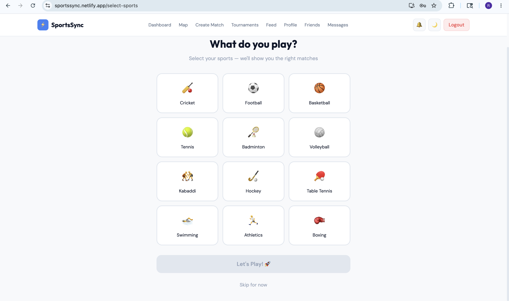

---

## Login Page

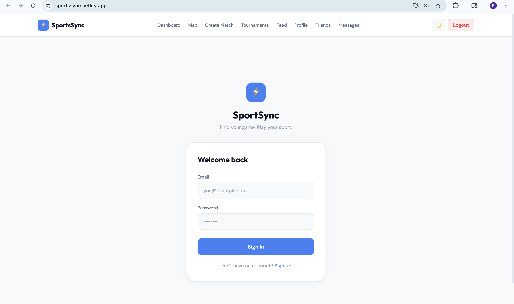

---

## Dashboard

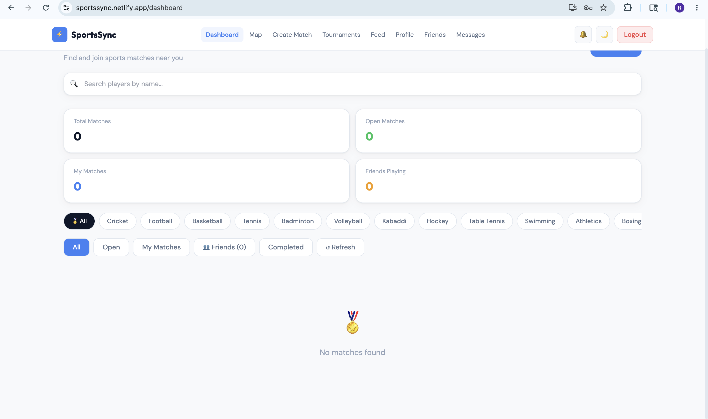

---

## Profile Page

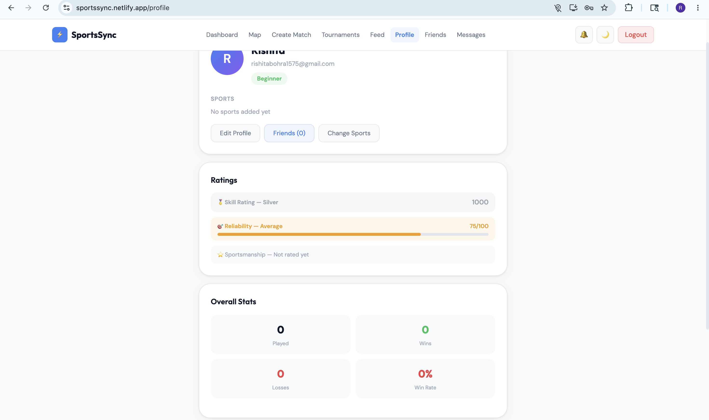

---

## Friends Section

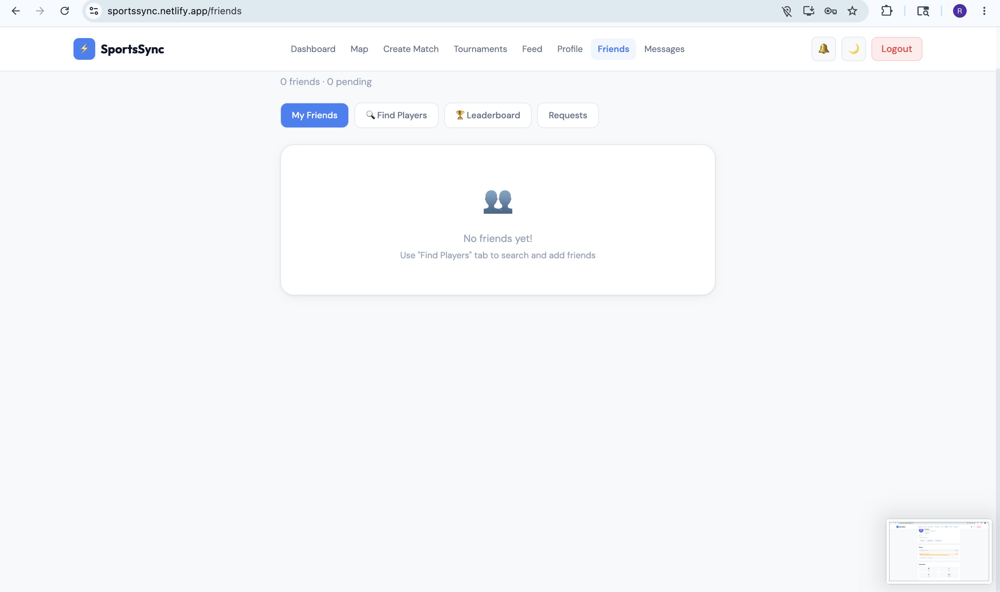

---

## Messages Section

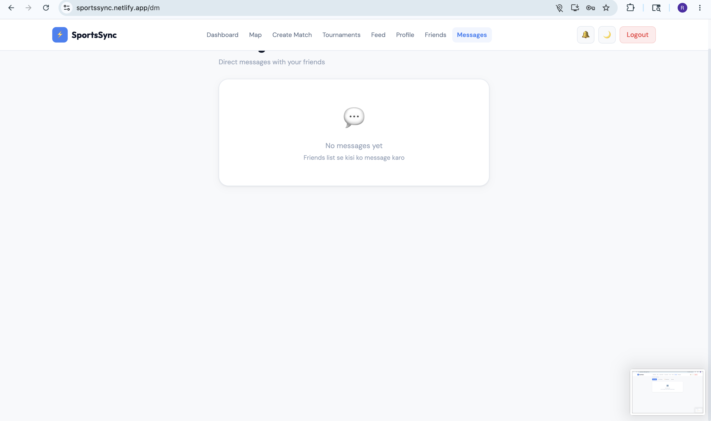

---

## Tournament Page

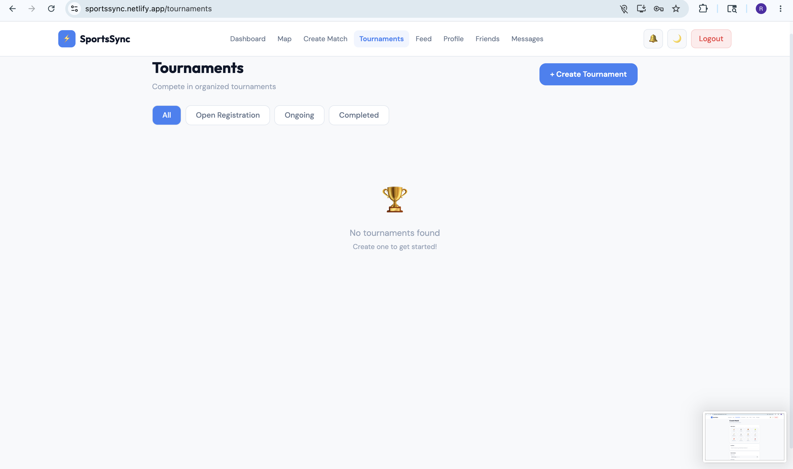

---

## Activity Feed

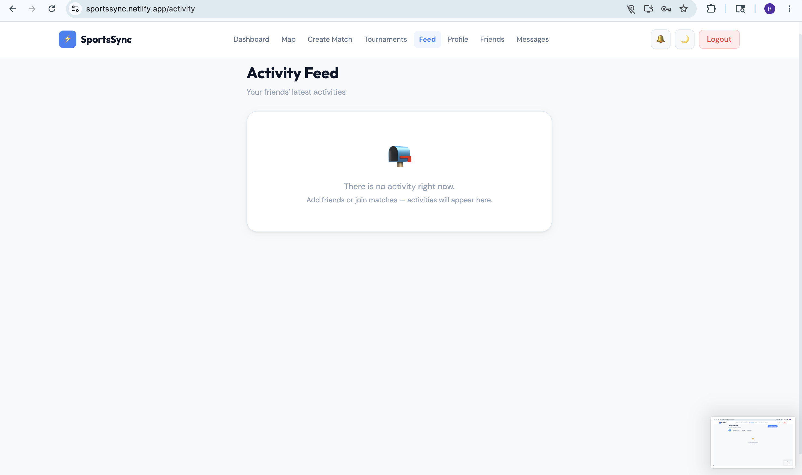

---

## Dark Theme Dashboard

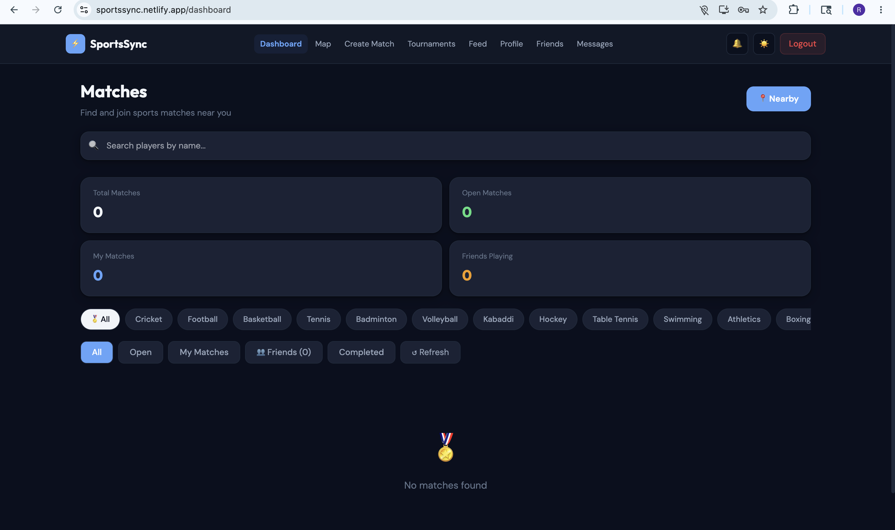

---

## Dark Theme Profile

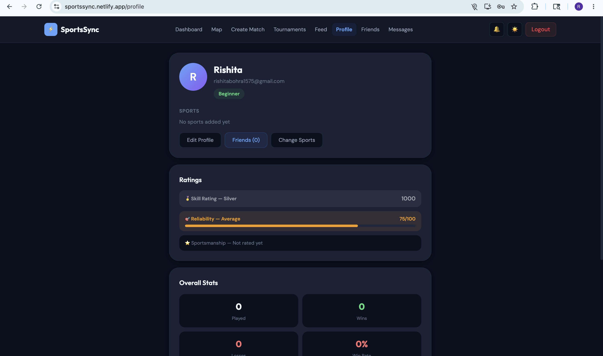

---

## Dark Theme Create Match

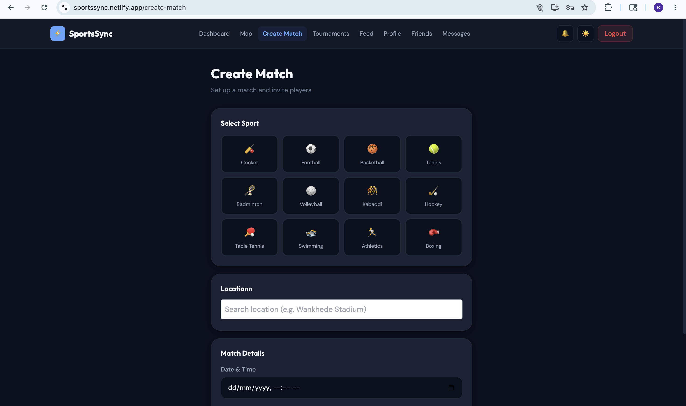

# Author

Rishita Bohra

GitHub:
https://github.com/rishitabohra